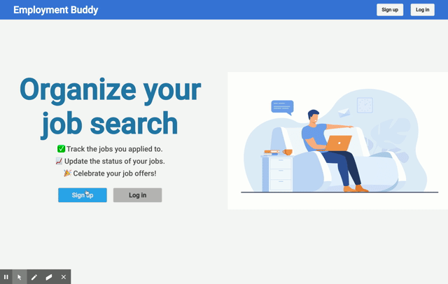
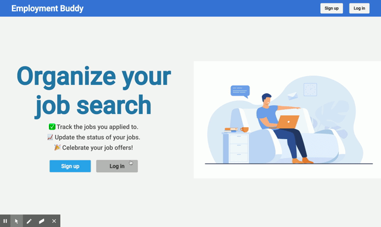
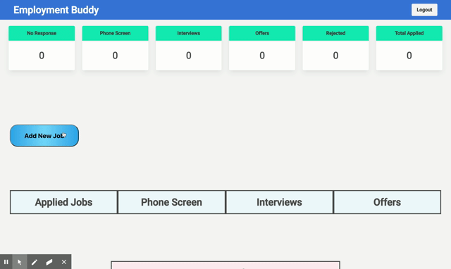
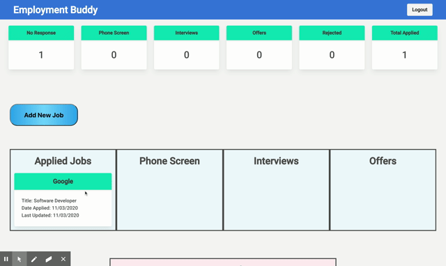
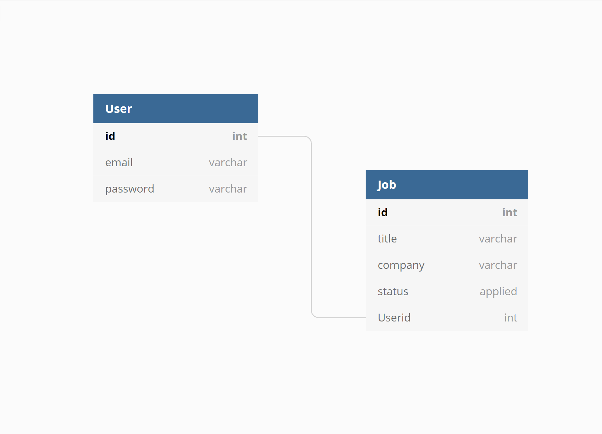

# Employment Buddy

This app helps you stay organized for your job hunt 📊

[Deployment](https://employmentbuddy.herokuapp.com/)

## Description

Employment Buddy, Your Job Search Best Friend.

This application helps the user organize their job search online. The user can create create a personal account to use this application. Once logged in, the user can create a new job to enter into the database. The application status can be tracked using an easy drag and drop functionality.

## Table of Contents

- [Installation](#installation)
- [Usage](#usage)
- [Technologies](#technologies)
- [Credits](#credits)
- [License](#license)

## Installation

Click on the deployment link [Deployment](https://employmentbuddy.herokuapp.com/).

## Usage

<ol>
<li>Signup for new account or login into your existing account</li>

#### How to Signup

You enter in your email address and a custom password to create an account.

#### How to Login

If you are a returning user, you login into your account with your email address and password.

<li>Create New Job</li>

#### How to Create New Job

You click on the new job button and enter in the name of the company and the position that you applied to. The date of when you entered will automatically be added.

<li>Update Jobs</li>

#### How to Update Your Job

To update your job status, you click and drag the job card to the appropriate column. The last updated date will automatically be updated as well.

</ol>

## Technologies

### Dependencies

- cryptjs
- dragula.js
- express
- jquery
- mysql
- passport
- sequelize

### Languages

- HTML
- CSS
- Javascript

### Design Libraries

- Bulma
- Undraw
- Font Awesome

### Modals

The user modal has an email and password to create a unique account to be added to the database. An unique id is automatically created for each user and this unique id is assigned to the jobs modal.

## Credits

David Anusontarangkul
[Github](https://github.com/anusontarangkul)
[LinkedIn](https://www.linkedin.com/in/anusontarangkul/)

Ryan Nemec
[Github](https://github.com/perfectoment)
[LinkedIn](https://www.linkedin.com/in/ryan-nemec-5a6b3a66/)

Jonathan Honda
[Github](https://github.com/hondahelix)
[LinkedIn](https://www.linkedin.com/in/jonathan-honda-778430153/)

This project was apart of UC Berkeley Coding Bootcamp.

## License

Copyright <2020> <COPYRIGHT HOLDER>

Permission is hereby granted, free of charge, to any person obtaining a copy of this software and associated documentation files (the "Software"), to deal in the Software without restriction, including without limitation the rights to use, copy, modify, merge, publish, distribute, sublicense, and/or sell copies of the Software, and to permit persons to whom the Software is furnished to do so, subject to the following conditions:

The above copyright notice and this permission notice shall be included in all copies or substantial portions of the Software.

THE SOFTWARE IS PROVIDED "AS IS", WITHOUT WARRANTY OF ANY KIND, EXPRESS OR IMPLIED, INCLUDING BUT NOT LIMITED TO THE WARRANTIES OF MERCHANTABILITY, FITNESS FOR A PARTICULAR PURPOSE AND NONINFRINGEMENT. IN NO EVENT SHALL THE AUTHORS OR COPYRIGHT HOLDERS BE LIABLE FOR ANY CLAIM, DAMAGES OR OTHER LIABILITY, WHETHER IN AN ACTION OF CONTRACT, TORT OR OTHERWISE, ARISING FROM, OUT OF OR IN CONNECTION WITH THE SOFTWARE OR THE USE OR OTHER DEALINGS IN THE SOFTWARE.
